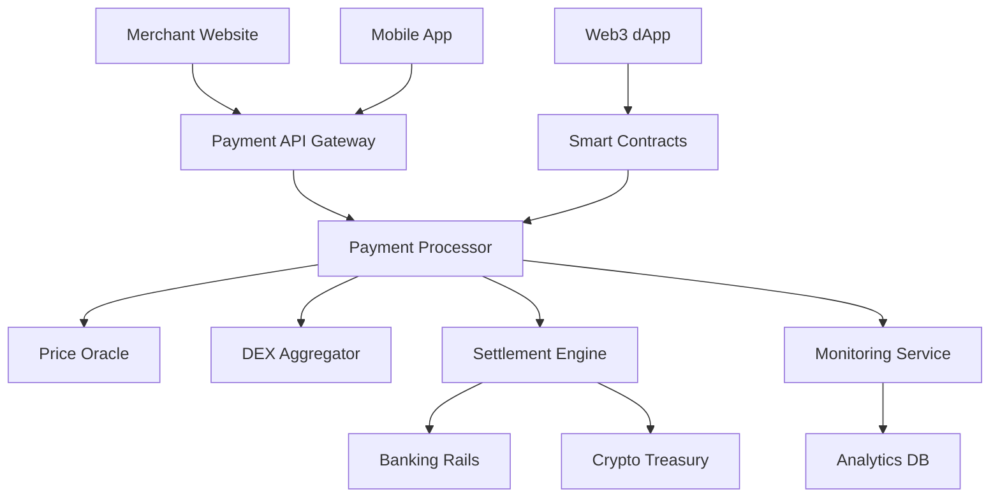

# MVP Features & Technical Implementation

## MVP Scope

The Minimum Viable Product focuses on core payment processing functionality with essential features to validate the product-market fit. The MVP supports Stacks blockchain with Bitcoin integration and one additional EVM chain (Ethereum).

## Core Features

### 1. Payment Processing Engine

#### 1.1 Smart Contract Payment Processor
**Technology**: Clarity smart contracts on Stacks

**Functionality**:
- Accept payments in STX, BTC, and major stablecoins (USDC, USDT)
- Automatic payment verification and confirmation
- Escrow mechanism for pending transactions
- Fee calculation and distribution

**Implementation**:
```clarity
;; Core payment contract structure
(define-map payments
  { payment-id: (string-ascii 64) }
  {
    merchant: principal,
    amount: uint,
    token: principal,
    status: (string-ascii 20),
    timestamp: uint
  })

(define-public (process-payment
  (payment-id (string-ascii 64))
  (merchant principal)
  (amount uint)
  (token principal))
  ;; Payment processing logic
)
```

#### 1.2 Multi-Chain Bridge Integration
**Supported Chains**: Stacks (primary), Ethereum (secondary)

**Functionality**:
- Cross-chain payment detection
- Automated token bridging for settlements
- Chain-specific transaction monitoring

### 2. Instant Settlement System

#### 2.1 Price Oracle Integration
**Oracles**: Redstone for Stacks, Chainlink for Ethereum

**Functionality**:
- Real-time price feeds for supported tokens
- Price validation and consensus mechanisms
- Slippage protection for conversions

**Implementation Flow**:
1. Customer initiates payment in crypto
2. System fetches current exchange rate
3. Calculates equivalent fiat amount
4. Locks conversion rate for 10 minutes
5. Processes payment and settlement

#### 2.2 Automated Conversion Engine
**Integration**: DEX aggregation (Alex Protocol for Stacks, 1inch for Ethereum)

**Functionality**:
- Automatic token-to-token conversion
- Best rate discovery across multiple DEXs
- MEV protection and slippage controls

### 3. Merchant Dashboard

#### 3.1 Payment Management Interface
**Technology**: React.js with TypeScript

**Features**:
- Real-time payment monitoring
- Transaction history and filtering
- Payment link generation
- Refund processing interface

#### 3.2 Settlement Configuration
**Functionality**:
- Choose settlement currency (fiat or crypto)
- Set conversion preferences
- Configure automatic vs manual settlements
- Treasury management tools

### 4. Developer Integration APIs

#### 4.1 RESTful Payment API
**Base URL**: `https://api.multichain-gateway.com/v1`

**Core Endpoints**:
```javascript
// Create payment request
POST /payments
{
  "amount": 100.00,
  "currency": "USD",
  "accepted_tokens": ["STX", "USDC", "ETH"],
  "settlement_currency": "USD",
  "merchant_id": "merchant_123",
  "callback_url": "https://merchant.com/webhook"
}

// Check payment status
GET /payments/{payment_id}

// List payments
GET /payments?merchant_id={id}&status={status}
```

#### 4.2 Webhook System
**Functionality**:
- Real-time payment notifications
- Status update broadcasts
- Failed payment alerts
- Settlement confirmations

**Webhook Payload Example**:
```json
{
  "event": "payment.completed",
  "payment_id": "pay_1234567890",
  "amount": "100.00",
  "currency": "USD",
  "token_amount": "0.05",
  "token": "STX",
  "status": "completed",
  "timestamp": "2024-01-15T10:30:00Z"
}
```

### 5. Web3 Payment Widget

#### 5.1 Universal Payment Component
**Technology**: React component with wallet integrations

**Supported Wallets**:
- Hiro Wallet (Stacks)
- Xverse (Stacks/Bitcoin)
- MetaMask (Ethereum)
- WalletConnect v2

**Implementation**:
```jsx
import { PaymentWidget } from '@multichain-gateway/react';

function CheckoutPage() {
  return (
    <PaymentWidget
      amount={100}
      currency="USD"
      acceptedTokens={['STX', 'USDC', 'ETH']}
      onSuccess={(payment) => console.log('Payment completed:', payment)}
      onError={(error) => console.error('Payment failed:', error)}
    />
  );
}
```

#### 5.2 Mobile-Responsive Design
**Features**:
- Touch-optimized interface
- QR code payment support
- Deep linking to mobile wallets
- Progressive Web App capabilities

### 6. Security & Compliance Framework

#### 6.1 Transaction Monitoring
**Functionality**:
- Real-time fraud detection
- Suspicious activity flagging
- Compliance reporting automation
- Risk scoring algorithms

#### 6.2 KYC/AML Integration
**Provider**: Jumio for identity verification

**Features**:
- Merchant onboarding verification
- Transaction threshold monitoring
- Automated compliance reporting
- Sanctions list screening

## Technical Architecture

### System Components



### Data Flow

1. **Payment Initiation**:
   - Customer selects crypto payment option
   - System generates payment request with locked rates
   - Customer completes payment via wallet

2. **Payment Processing**:
   - Smart contract validates transaction
   - Oracle confirms current exchange rates
   - System calculates settlement amounts

3. **Settlement Execution**:
   - Automatic conversion to preferred currency
   - Transfer to merchant's designated account
   - Generate confirmation and receipts

### Infrastructure Requirements

#### Blockchain Infrastructure
- **Stacks Node**: Full node with event streaming
- **Bitcoin Node**: For BTC payment verification
- **Ethereum Node**: For EVM chain interaction
- **IPFS**: For metadata and receipt storage

#### Backend Services
- **API Gateway**: Rate limiting and authentication
- **Message Queue**: Redis for async processing
- **Database**: PostgreSQL for transactional data
- **Cache**: Redis for session and price data

## Performance Specifications

### Transaction Throughput
- **Target TPS**: 100 transactions per second
- **Settlement Time**: < 30 seconds average
- **Uptime SLA**: 99.9% availability

### Security Standards
- **Smart Contract Audits**: Quarterly security reviews
- **Penetration Testing**: Bi-annual external audits
- **Compliance**: SOC 2 Type II certification

### User Experience Metrics
- **Payment Success Rate**: > 99.5%
- **Average Integration Time**: < 2 hours
- **Customer Support Response**: < 1 hour

## MVP Success Criteria

### Technical Milestones
- [ ] Successfully process 1,000 test transactions
- [ ] Achieve 99.5% transaction success rate
- [ ] Complete security audit with zero critical issues
- [ ] Integrate with 3 major wallet providers

### Business Validation
- [ ] Onboard 50 pilot merchants
- [ ] Process $100K in transaction volume
- [ ] Achieve 4.5+ merchant satisfaction rating
- [ ] Generate positive unit economics

### Developer Adoption
- [ ] 100+ developers sign up for API access
- [ ] 20+ successful integrations completed
- [ ] Community feedback score > 4.0/5.0
- [ ] Technical documentation completeness > 95%

## Known Limitations

### MVP Constraints
- Limited to 2 blockchain networks initially
- Manual compliance review for large transactions
- Basic analytics and reporting features
- Single settlement currency per merchant

### Technical Debt
- Simplified DEX routing algorithms
- Basic fraud detection rules
- Limited multi-signature treasury features
- Minimal mobile optimization

### Future Enhancement Areas
- Advanced analytics and business intelligence
- Multi-signature treasury management
- Additional blockchain network support
- Enhanced fraud detection and prevention